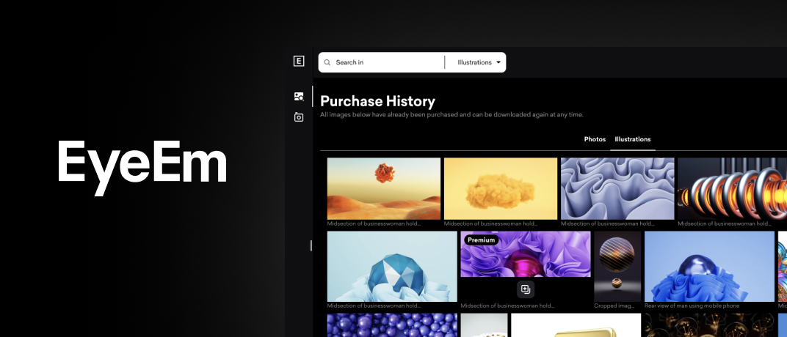

#### About EyeEm

**EyeEm** is as a global photography community and marketplace that facilitates connections between creators and prominent brands to source original and on-brand content. The platform's mission centers around empowering its community by providing them with a robust platform for discovery, while simultaneously granting brands access to powerful creative imagery from around the globe.

#### My role at EyeEm

During my role at EyeEm, I was part of the Product Desgin team collaborating on platform maintenance, conducting research, desiging new features, prototyping, and testing solutions to deliver the best possible version for implementation.

#### EyEem's Cart & Checkout Flow

In 2022, EyeEm re-vamped the Cart and Checkout Process project with the scope of increasing the revenue in short term. We started by making a descriptive analysis of the current flow supported by the data collected on the abandonment rate.

Figma screenshot describing the flow for loggout desktop users

Analising the data, we discovered that:

- about 95% of the users who completed a purchase were desktop users
- more than 60% of users didn't proceed in the authetication step
- about 15% of users exited EyeEm.com after seeing the authentication screen

As our main scope was to focus on the quick wins, it was clear to us that we needed draw the flow for desktop loggedout users and W mapped all UI pain points on it in Figma.

Zoom-in to Figma identifying pain points on the Cart phase

##### Proposal 1

##### Proposal 2

##### Redesigned screens

#### Cart Dropdown Redesign

##### Prototype

#### EyeEm's Web presence

<a href="http://eyeem.com" target="_blank">EyeEm.com</a> combines the flexibility of Webflow with the capabilities of front-end development, giving designers complete control over the UI and behavior of some areas of the website. During my time at EyeEm, I was responsible for maintaining the site.

In addition to the main webpage, EyeEm frequently launched landing pages to support ongoing marketing campaigns. Collaborating closely with the Marketing and Innovation teams, I was involved in the ideation, design, and conceptualization of these sites. I then took full responsibility for the implementation and final release of these web projects using Webflow, sharing account control with the Front-End Team.

Here are some live examples:

<a href="http://eyeem.com" target="_blank">eyeem.com</a>

<a class="inline-link" href="https://www.eyeem.com/magazine" target="_blank">eyeem.com/magazine

<a href="https://www.eyeem.com/awards" target="_blank">eyeem.com/awards

<a href="https://creativetrends.eyeem.com/" target="_blank">creativetrends.eyeem.com

