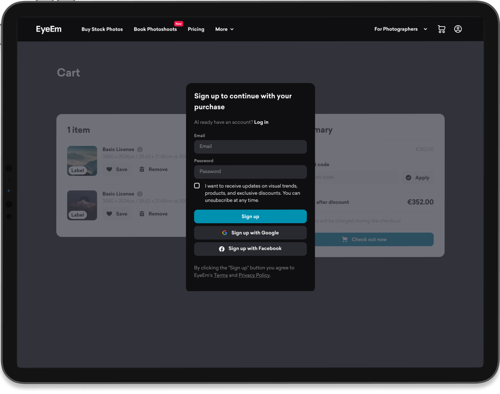

I worked in EyeEm for 2+ years, contributing on the brower-based platform, owning the Webflow account and helping with the recruitment of new designers to build a new Product Design Team.

  

    
 Product Designer

    
 Berlin, Hybrid

    
 2021 - 2023

  

#### About EyeEm

**EyeEm** is as a photography community and marketplace that facilitates connections between creators and prominent brands to source original and on-brand content.

#### My role at EyeEm

During my role at EyeEm, I was part of the Product Desgin team collaborating on platform maintenance, conducting research, designing new features, prototyping, and testing solutions.

#### The Platform

EyeEm is a browser-based platform for photographers to get discovered and for brands to access a curated selection of images, dividing the user base into two main groups: the creators and the buyers.

#### The Product Team

Our Product Design team worked closely with project managers, data analysts and developers. With regular meetings and sync-ups, we united forces to work on the continuous development of the platform. We would start by gathering the relevant numbers so ensure we would be working on data-driven solutions.

In the case of the redesign of the Cart & Checkout process, I reviewed the data research and report made by the team on the previous months, and then created a descriptive analysis mapping the pain points of the flow.

Identifying Data take-aways and UI pain points on the Cart & Checkout flow

This part of the process was crucial to identify the Quick Wins and Long-term fixes. I noticed that the drops on the flow could be related to inconsistencies in the background color along the flow, TAX calculation being done too soon during the process and wrong implementation of the SSO with Google and Facebook for logged out users. 

During the checkout, I had to involve the legal team to make sure we could go full-in with major changes during Checkout like pre-saving the billing information and payment details.

#### Low-fi & Prototype

I moved then into creating the first prototypes to be discussed with the Data and Front-End team. This sessions were very useful to get their insights, gather their feedback and understand the capacity of the developers. After a couple of iterations, we came up with a solution that ticked all boxes from the our Quick wins list.

<a href="https://www.figma.com/proto/8uY2K7IVQ9ZY0zZ6nbfgLY/Cart-%26-Checkout-process-(Quick-wins)-(Copy)?page-id=2754%3A8279&node-id=2767-16673&viewport=831%2C395%2C0.06&t=CbdfJQfKEAJWeuO0-1&scaling=min-zoom&starting-point-node-id=2767%3A16673&show-proto-sidebar=1
" target="_blank">Check final prototype</a>

Figma screenshot from the Low-fi Prototype on the Cart phase, marking UI and interaction issues

#### Hi-fi & Redesigned screens

The final step at EyeEm would be to prepare the High-Fidelity mockups usign the library with the Design system. This to ensure consistency with the rest of the platform and to be in sync with the UI Kit the Fron-End developers were using.

Close-up to the Hi-fi redesigned screens. On top, the Cart view with the Authentication screen in overlay. Below, a section of the Thank you screen at the end of the purchase.

#### EyeEm's Web presence

<a href="http://eyeem.com" target="_blank">EyeEm.com </a> combines the flexibility of Webflow with the capabilities of front-end development, giving designers complete control over the UI and behavior of some areas of the website. During my time at EyeEm, I was responsible for maintaining these areas of the site.

In addition to the main webpage, EyeEm frequently launched landing pages to support ongoing marketing campaigns. Collaborating closely with the Marketing and Innovation teams, I was involved in the ideation and design of these sites. I then took full responsibility for the implementation and final release of these web projects using Webflow.

Here are some live examples:

<a href="http://eyeem.com" target="\_blank">eyeem.com</a>

<a href="https://www.eyeem.com/magazine" target="_blank">eyeem.com/magazine

<a href="https://www.eyeem.com/awards" target="\_blank">eyeem.com/awards

<a href="https://creativetrends.eyeem.com/" target="\_blank">creativetrends.eyeem.com

